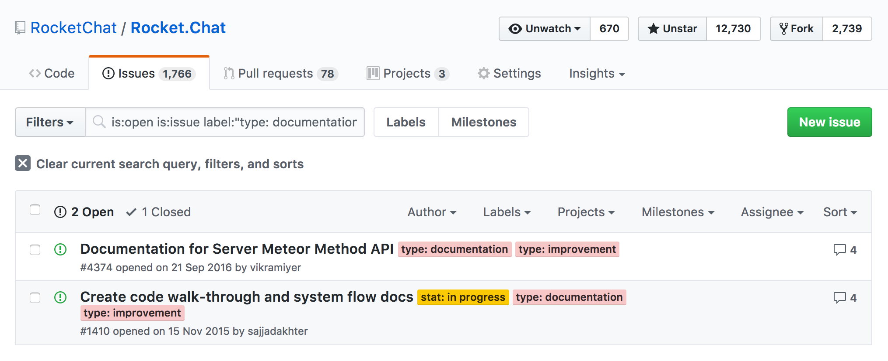
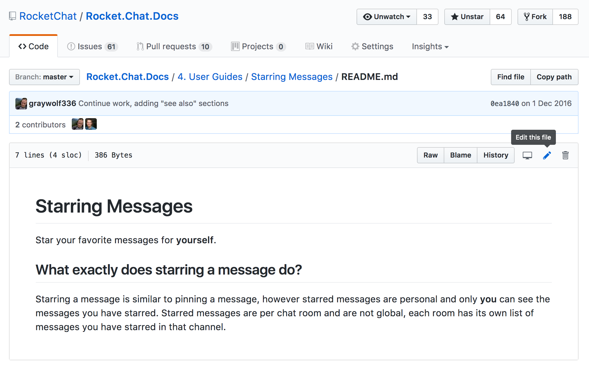
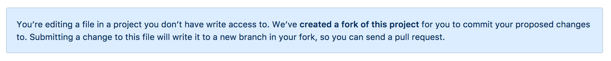
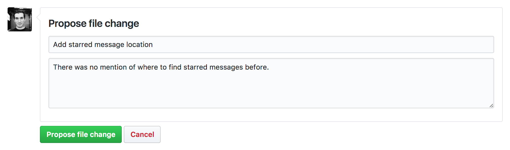

# Contributing

Work in progress: needs tutorial.

We have many projects at Rocket.Chat, from the Meteor server web application to out various packaging scripts, APIs and client applications. Pick a project that you care about or want to carve a piece of ownership in.

In the coming weeks we will add missing/outdated article lists and reference articles to each project to make it easier for you to get started.

To find out how documentation should ideally be structured in each Rocket.Chat project take a look at the [structure guide](../structure/) and for styling take a look at the [style guide](../style/).

## Writing Documentation on GitHub Tutorial

For each project you can either setup a local development stack for the static site generator (SSG) used or contribute directly on the GitHub project.

At the moment we use a few different SSGs for our projects, for example the main Rocket.Chat documentation uses a [custom Node.js generator](https://github.com/RocketChat/Rocket.Chat.Docs.Generator) built with the metalsmith package and this portal uses [Jekyll](https://jekyllrb.com/).

If you are interested in setting up these stacks locally visit the projects to find out how but the quickest and easiest way to begin contributing is to work directly on GitHub. This tutorial will walk you through everything you need to know to start contributing documentation to Rocket.Chat projects.

### Create a GitHub account

To contribute to our projects on GitHub you will need to register for a free account. If you don't already have one, head over to [GitHub](https://github.com/) and complete the Sign up process.

### Find an Documentation issue or Task to work on

Browse our list of projects with documentation, choose a project you would like to contribute to and navigate to the project's GitHub issues page. For example if you wanted to improve the Rocket.Chat documentation you would need to:

1. Browse to the [Rocket.Chat project on GitHub](https://github.com/RocketChat/Rocket.Chat)
1. Navigate to the [project's issues]( https://github.com/RocketChat/Rocket.Chat/issues)
1. Filter the issues by the [`documentation` label](https://github.com/RocketChat/Rocket.Chat/issues?q=is%3Aopen+is%3Aissue+label%3A%22type%3A+documentation%22)
1. Search through the issues to see if the improvement you would like to make has already been suggested
1. If no issue exists for the improvement you would like to make, create one

Now that you have found or created an issues it's time to start writing documentation.

### Editing markdown files on GitHub

Navigate to the file you would like to edit and click the pen icon to "Edit this file".

Before you begin editing GitHub will let you know if you don't have permission to save your changes directly to the project and inform you that it will create a fork (copy) of the project under your account and save them there (this will only happen when you propose the changes).  

Once you finished editing the file, give your proposed changes a tile and an optional longer description and submit them. This will start a pull request (PR) from your project to the original which informs the project's admins to review and pull your proposed changes from your copy into their master version.

Once your change a been proposed make sure to complete the process by clicking the `Create pull request` button.

### Getting feedback on your changes

Once your pull request has been sent it will either:

1. Be accepted and your changes will be merged with the main project.
1. Receive feedback requesting for style or content changes.
1. Be rejected if it is not relevant (very unlikely as we prefer to give feedback and work to get your contributions included).

### Keep up to date with what others are contributing

Working on a open source project allows you to be part of a passionate community. Your feedback as a community member and contributor is important to us so please participate in a project's PR discussions. PRs, like issues can also be filtered by labels, making it easier for you to follow the topics you are the most interested in.

If you would like to track and measure your contributions take a look at a project's contributor analytics by clicking on the **contributors** count on a project's home page. Most open source projects have a few people who contribute a lot and many people who contribute a little, so without much effort you can quickly rise in the contribution charts. 
